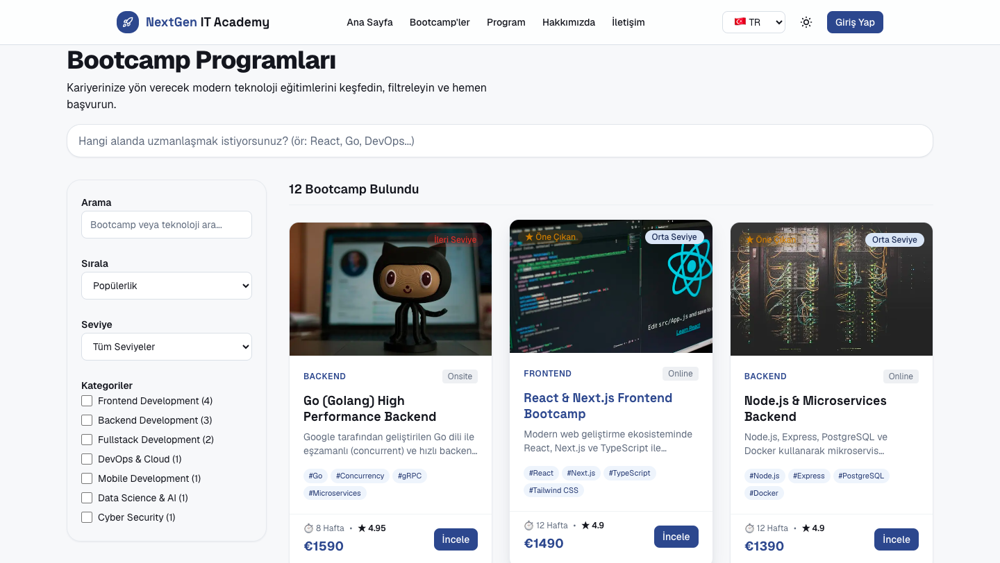
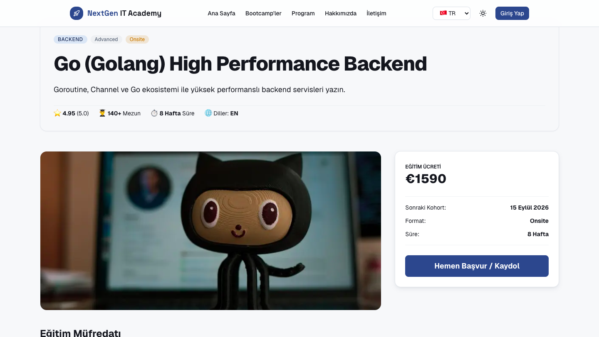
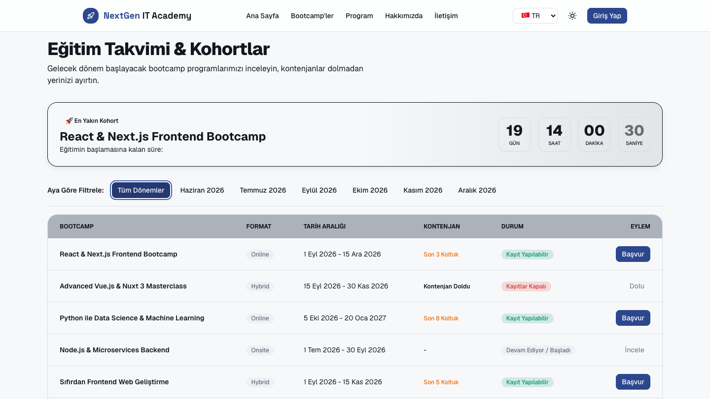

# NextGen IT Academy — Bootcamp Sitesi

Bootcamp'leri keşfetmek, karşılaştırmak, kohort takvimini takip etmek ve kayıt sürecini başlatmak için kurumsal, çok dilli bir eğitim platformu. Referans: [global-it.team-vit-devops.nl](https://global-it.team-vit-devops.nl) (içerik/bilgi mimarisi baz alındı — görsel dil ve komponent yapısı özgün, piksel klon değil).

**Canlı:** [bootcamp-three-chi.vercel.app](https://bootcamp-three-chi.vercel.app/)

---

## Ekran Görüntüleri

| Ana Sayfa                               | Bootcamp Listesi                                         |
| --------------------------------------- | -------------------------------------------------------- |
|  |  |

| Bootcamp Detay                                          | Eğitim Takvimi                                   |
| ------------------------------------------------------- | ------------------------------------------------ |
|  |  |

---

## Kurulum

```bash
npm install
npm run dev
```

Diller: `localhost:3000` (TR, varsayılan/prefixsiz), `localhost:3000/en`, `localhost:3000/nl`

**Teslimden önce çalıştırılması gereken kontrol zinciri** (her PR'da uygulandı):

```bash
npm run typecheck
npm run lint
npm run format:check
npm run build
```

---

## Stack ve Neden Seçildiği

| Teknoloji                                | Neden                                                                                                                                                                                                                                            |
| ---------------------------------------- | ------------------------------------------------------------------------------------------------------------------------------------------------------------------------------------------------------------------------------------------------ |
| **Next.js 16 (App Router) + TypeScript** | Server Components varsayılan — sadece etkileşimli kısımlar client'a taşınıyor, bu da build-time SSG'yi mümkün kılıyor (bkz. Mimari Kararlar). `strict` TypeScript, `any` yasak.                                                                  |
| **Tailwind CSS v4**                      | Design token'lar CSS değişkeni olarak tanımlanıp `@theme inline` ile Tailwind'e bağlanıyor — tek kaynaktan (globals.css) hem light/dark tema hem de utility class'lar besleniyor.                                                                |
| **next-i18next v16**                     | App Router'ın Server/Client Component ayrımıyla uyumlu, server-side `getT()` API'si sunduğu için tercih edildi.                                                                                                                                  |
| **Framer Motion**                        | Sayfa geçişleri (`AnimatePresence`) ve scroll-tetikli animasyonlar (`how-it-works.tsx`) için; `prefers-reduced-motion` desteği framer'ın kendi `useReducedMotion()` hook'uyla native olarak geliyor.                                             |
| **class-variance-authority (cva)**       | Button/Badge gibi çok varyantlı komponentlerin prop→class eşlemesini tip güvenli ve tutarlı tutmak için. Harici bir komponent kütüphanesi (shadcn, MUI vb.) **kullanılmadı** — tüm UI komponentleri design token'lar üzerinden sıfırdan yazıldı. |
| **lucide-react**                         | Tüm site genelinde tutarlı, tek bir ikon dili için (emoji veya karışık ikon kaynaklarından kaçınıldı).                                                                                                                                           |
| **Vercel**                               | `main` branch'e her merge'de otomatik deploy, Next.js'in kendi altyapısı olduğu için App Router özel route'ları (metadata dosyaları, ISR) ekstra config gerektirmeden çalışıyor.                                                                 |

---

## Mimari Kararlar ve Gerekçeleri

Bunların çoğu, geliştirme sürecinde **gerçekten karşılaşılan hatalardan** çıkan kararlar — sadece "iyi pratik" değil, somut bir sorunu çözdükleri için burada:

### 1. `getT()` çağrılarına `lng` açıkça geçiliyor

next-i18next'in `getT(ns, options)` fonksiyonu, `options.lng` verilmezse dahili olarak `headers()`/`cookies()` çağıran bir `detectLanguage()` adımına düşüyor. Next.js'te bu iki fonksiyon "Dynamic API" — kullanıldıkları an içinde bulundukları **tüm render ağacını** `generateStaticParams` olsa bile dynamic render'a zorluyor. Projede 13 farklı yerde bu hataya düşülmüştü; hepsine route param'dan gelen `locale` açıkça `{ lng: locale }` olarak geçildi. Sonuç: **9 sayfa dynamic (ƒ) → statik (●)** oldu, `/bootcamps/[slug]` için 36 sayfa (12 bootcamp × 3 dil) build zamanında önceden üretiliyor.

### 2. `generateMetadata` için `'use client'` sayfaları server/client olarak bölündü

Next.js, `'use client'` işaretli dosyalardan `generateMetadata` export edilmesine izin vermiyor. `contact`, `schedule`, `auth/login`, `auth/register` sayfaları başta tamamen client component'ti; her biri `<sayfa>-content.tsx` (interaktif, client) + `page.tsx` (server, sadece `generateMetadata` + `<Content />` render) olarak ikiye bölündü.

### 3. Mobil menü `document.body`'ye portal ediliyor

Header'daki `backdrop-blur` (CSS `backdrop-filter`), spesifikasyona göre içindeki `position: fixed` elemanlar için yeni bir _containing block_ oluşturuyor. Mobil menü header'ın içine nested render edildiği için, tam ekran kaplaması gereken panel viewport yerine header'ın kendi 64px'lik kutusuna sıkışıyordu. `createPortal` ile `document.body`'ye taşınarak çözüldü.

### 4. i18n route middleware'i statik dosyaları (`robots.txt`, `sitemap.xml`) hariç tutuyor

`proxy.ts`'teki middleware matcher'ı başta bu iki dosyayı da yakalayıp locale routing'e sokuyor, 404'e düşürüyordu. Matcher'a `robots.txt|sitemap.xml` istisnası eklendi.

### 5. Mock veri `src/data/` altında, tekil TypeScript dosyaları olarak

Kohort verisi başta `schedule/page.tsx` içine gömülüydü — bu hem spesifikasyona aykırıydı hem de aynı veriye ihtiyaç duyan bootcamp detay sayfasındaki "Sonraki Kohort" alanının **hardcoded bir tarih** göstermesine yol açmıştı (hiçbir kohorta bağlı değildi). Veri `src/data/cohorts.ts`'e taşınıp 16 kayda çıkarıldı, bootcamp detay sayfası artık kendi bootcamp'ine ait gerçek en yakın kohortu hesaplıyor (`getNextCohortLabel`).

### 6. Bileşen kütüphanesi kullanılmıyor

Button, Card, Badge, Input, Select, Checkbox, Skeleton, Spinner — hepsi design token'lar üzerinden, `cva` ile varyant yönetilerek sıfırdan yazıldı. Amaç: jenerik SaaS "hazır kütüphane" görünümünden kaçınmak, design token'ların her komponentte tutarlı uygulanmasını garanti etmek.

---

## Design Token'lar

Kurumsal/güven verici yön: koyu mavi (primary) + soğuk gri (neutral) + turkuaz vurgu (accent, CTA'lar için). Tüm token'lar `src/app/[locale]/globals.css`'de tanımlı, `@theme inline` ile Tailwind'e bağlı.

Dark mode class tabanlı (`html.dark`), localStorage'da kalıcı, ilk yüklemede sistem tercihi (`prefers-color-scheme`) okunuyor, FOUC yok (`next/script` ile `beforeInteractive` stratejisi).

- **Renkler:** `primary-50..950`, `neutral-50..950`, `accent-400/500/600`, `secondary`, semantic (`success`, `warning`, `error`, `info`)
- **Yüzeyler:** `background`, `foreground`, `text`, `muted`, `surface`, `surface-muted`, `border`
- **Radius:** `sm` (4px), `md` (8px), `lg` (14px), `xl` (20px)
- **Shadow:** `sm`, `md`, `lg` (light/dark için ayrı opaklık değerleri)

Tüm token'ları ve komponentleri görsel olarak `/styleguide` sayfasında görebilirsin (arama motorlarına kapalı, `robots.txt`'te `disallow`).

---

## Klasör Yapısı

```
i18n.config.ts            → i18n ayarları (client-safe)
i18n.config.server.ts     → i18n ayarları + production resource loader (server-only)
public/locales/           → çeviri JSON'ları (tr, en, nl)
src/
  proxy.ts                → locale routing middleware (robots.txt/sitemap.xml hariç)
  app/
    sitemap.ts             → build-time /sitemap.xml (63 URL: statik sayfalar + bootcamp detaylar × 3 dil)
    robots.ts               → build-time /robots.txt
    [locale]/               → tüm sayfalar locale altında (/, /en, /nl gibi)
      layout.tsx             → I18nProvider, PageTransition, CookieConsent burada bağlanıyor
      globals.css
      page.tsx
      bootcamps/[slug]/      → generateStaticParams + generateMetadata, dinamik "sonraki kohort"
      styleguide/            → design token & komponent showcase sayfası
  components/
    ui/                    → paylaşılan UI komponentleri (Button, Card, Input, Badge, vb.)
    layout/                → Header, Footer, MobileNav (portal), PageTransition, CookieConsent
    bootcamps/              → BootcampCard, BootcampCurriculum
  fonts/                   → local font dosyaları
  lib/                     → yardımcı fonksiyonlar (cn(), i18n-utils vb.)
  types/                   → TypeScript tip tanımları (Bootcamp, Category, Instructor, Cohort, vb.)
  data/                    → mock veri (gerçekçi, lorem ipsum yok)
```

---

## Roller

- **R1 – Platform & Design System (Esra Demirtürk):** kurulum, design token'lar, tema, layout, i18n altyapısı, paylaşılan komponentler, mobil menü, sayfa geçişleri, cookie consent, SEO (metadata/sitemap/robots), mock data şeması, deploy
- **R2 – Marketing Pages:** Landing (Hero, Features, Pricing, Testimonials, Newsletter), About
- **R3 – Product Pages:** Bootcamps (liste + filtre), Bootcamp Detay, Schedule, Login/Register, 404

---

## Mock Data Hacmi

12 bootcamp, 8 kategori, 6 eğitmen, **16 kohort**, **8 yorum**, 3 fiyat planı, 6 özellik, 4 adım (how it works).

---

## Bilinen Eksikler

Dürüst değerlendirme — "şunu yapamadık" demek utanç değil:

- **BootcampCard duplikasyonu tam çözülmedi:** Bileşen iki farklı klasörde (`sections/`, `bootcamps/`) neredeyse birebir kopya olarak duruyordu; şimdilik `components/bootcamps/bootcamp-card.tsx` altında tek dosyaya indirgendi ve tüm kullanım yerleri buna yönlendirildi, ama `localizedHref` gibi bazı yardımcı fonksiyonlar hâlâ birden fazla dosyada tekrarlanıyor (`src/lib/i18n-utils.ts`'e taşınması planlandı, henüz tüm çağrı yerlerine uygulanmadı).
- **Mock bootcamp içerik metinleri (açıklamalar) sadece TR:** EN/NL sayfalarında bu alanlar `defaultValue` fallback'iyle Türkçe gösteriliyor — UI metinlerinin tamamı (buton, etiket, hata mesajı vb.) üç dilde de tam, ama bootcamp açıklama paragrafları çevrilmedi.
- **Öğrenci dashboard'u** tasarım aşamasında, bu depoya henüz merge edilmedi.
- **Gerçek backend, ödeme, video, admin panel** kapsam dışı (mock data ile çalışıyor).

---

## Teknik Notlar / Sık Karşılaşılan Sorunlar

- `generateStaticParams` tek başına statik üretimi garanti etmiyor — render ağacındaki herhangi bir `getT()`/`headers()`/`cookies()` çağrısı zinciri bozabilir. Yeni bir sayfa eklerken build çıktısındaki `●`/`ƒ` işaretini kontrol edin.
- Yeni bir route eklerken `src/proxy.ts`'teki middleware matcher'ını kontrol edin — kök seviye özel dosyalar (`robots.txt`, `sitemap.xml`, gelecekte eklenecek benzerleri) istisna listesine eklenmezse locale routing'e takılıp 404 verir.
- `next dev` (Turbopack) bazı route'larda (özellikle kök seviye metadata dosyaları) geçici routing tuhaflıkları gösterebiliyor; şüpheli bir 404 gördüğünüzde önce `npm run build && npm run start` ile production modunda doğrulayın.
